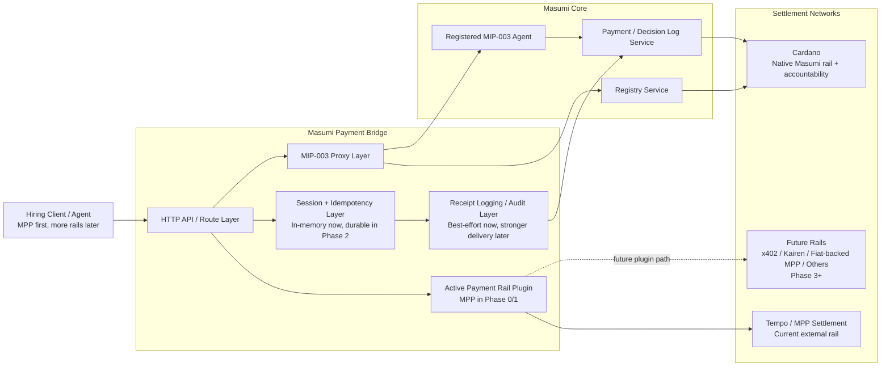
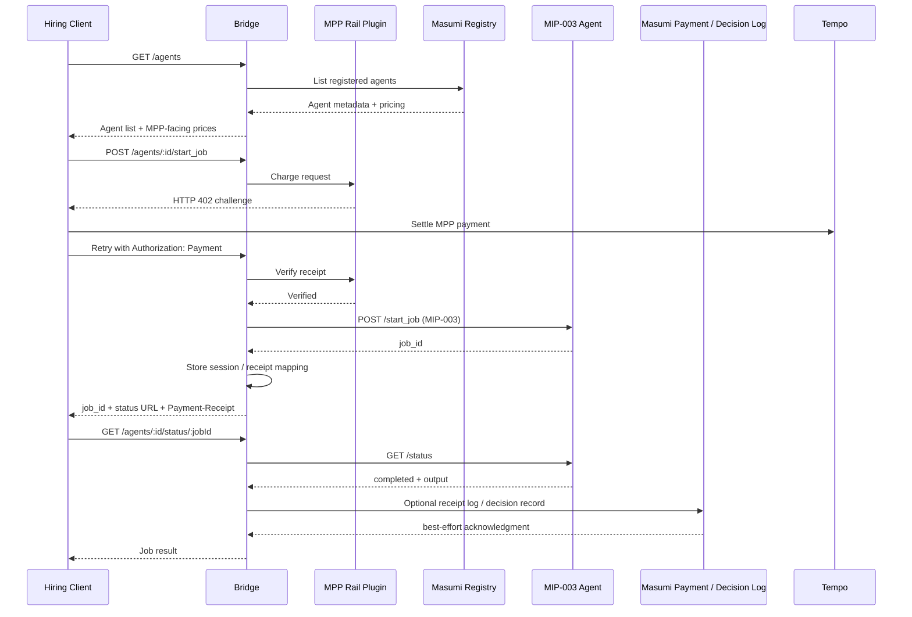
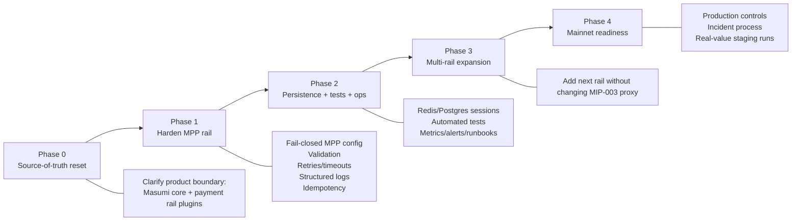
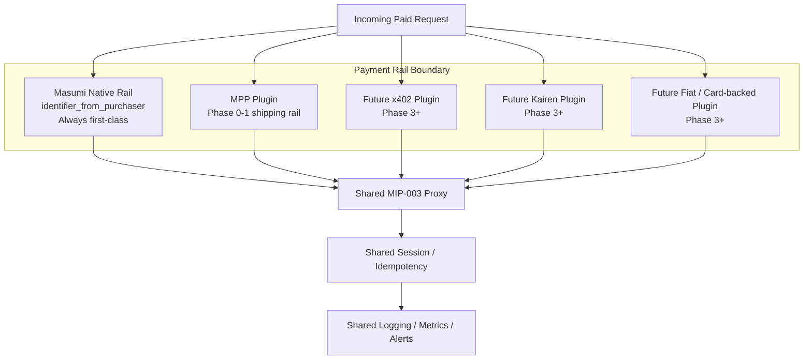
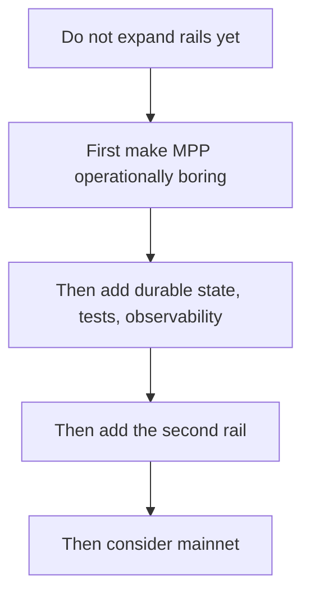

# Visual Architecture

This is the reference visual for the **roadmap-aligned architecture**.

Read it with the roadmap in [roadmap.md](roadmap.md):

- **Phase 0**: align docs, code, and product boundaries
- **Phase 1**: harden the first external rail
- **Phase 2**: add persistence, tests, and operations
- **Phase 3**: add more payment rails
- **Phase 4**: mainnet readiness

## 1. Target Architecture

## 2. Phase 0-1 Runtime Flow: MPP First

## 3. Phase-by-Phase Delivery Shape

## 4. Payment Rail Model

## 5. Roadmap Guardrails

## 6. Strategic Rule

The stable boundary is:

- **Masumi / MIP-003 behind the bridge**
- **Payment rail plugins in front of the bridge**

That lets Masumi stay Cardano-native where needed, while still supporting non-Cardano payment entry points without changing agent implementations.
